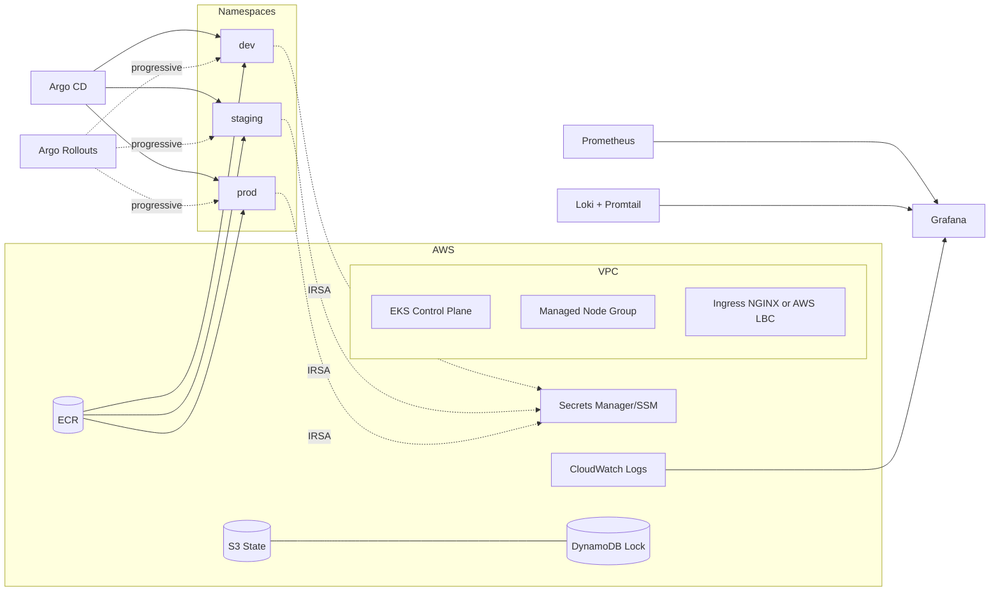
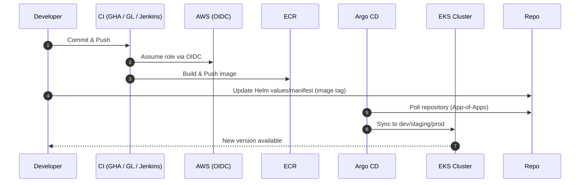
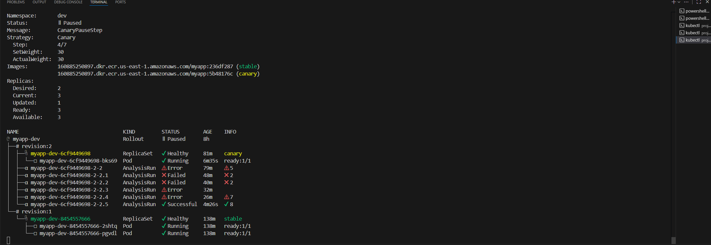
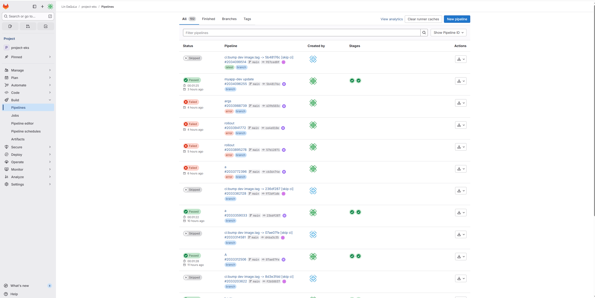
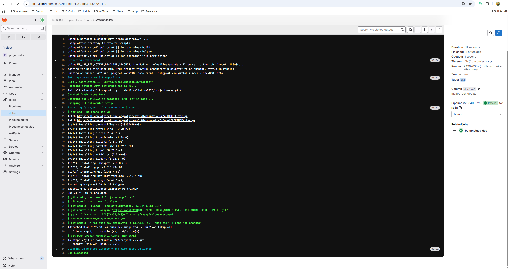

# Project EKS — AWS EKS Platform with GitOps, CI/CD, and Observability


**Stack:** EKS · Helm · Argo CD · GitHub Actions / GitLab CI / Jenkins · Prometheus/Grafana · Loki/CloudWatch · External Secrets
**Controls:** OIDC (no long‑lived keys) · IRSA · Least‑Privilege IAM · Remote State + Locking · Canary/Blue‑Green

A concise, production‑style reference implementation of a Kubernetes platform on AWS EKS. It provisions infrastructure with Terraform, delivers applications through GitOps (Argo CD), integrates three CI engines for container builds, and ships complete observability and logging. Security is strengthened with IRSA and secret retrieval via External Secrets.

---

## Table of Contents

* [Architecture](#architecture)
* [Delivery Flow](#delivery-flow)
* [Repository Layout](#repository-layout)
* [Quick Start](#quick-start)
* [GitOps Model](#gitops-model)
* [CI Pipelines](#ci-pipelines)
* [Observability](#observability)
* [Logging](#logging)
* [Autoscaling & Resilience](#autoscaling--resilience)
* [Security & Secrets](#security--secrets)
* [Operations & Cost](#operations--cost)
* [Cleanup](#cleanup)
* [Troubleshooting](#troubleshooting)
* [Design Rationale & Trade‑offs](#design-rationale--trade-offs)
* [License](#license)

---

## Architecture



---

## Delivery Flow



---

## Repository Layout

```
project-eks/
  infra/terraform/          # VPC / EKS / ECR / OIDC / NodeGroup (IaC)
  charts/                   # Helm Charts (myapp) with probes/resources/HPA
  manifests/                # Argo CD (root, apps), Rollouts, RBAC
  ci/
    github-actions/         # Workflows for ECR build/push
    gitlab-ci/              # .gitlab-ci.yml examples
    jenkins/                # Jenkinsfile, values for Helm install
  dashboards/               # Grafana dashboards (JSON exports)
  docs/                     # Architecture notes, ops playbooks, rollout drills
```

---

## Quick Start

1. **Provision infrastructure (Terraform)**

```bash
cd infra/terraform
terraform init && terraform plan
terraform apply -auto-approve
aws eks update-kubeconfig --region <region> --name <cluster>
kubectl get nodes
```

2. **Install cluster add‑ons**

```bash
# metrics-server
helm repo add metrics-server https://kubernetes-sigs.github.io/metrics-server/
helm upgrade --install metrics-server metrics-server/metrics-server -n kube-system \
  --set args={"--kubelet-insecure-tls"}

# ingress-nginx (or use AWS LBC)
helm repo add ingress-nginx https://kubernetes.github.io/ingress-nginx
helm upgrade --install ingress-nginx ingress-nginx/ingress-nginx -n ingress-nginx --create-namespace

kubectl create ns dev staging prod
```

3. **Build image & push to ECR** (choose a CI pipeline below). Example GitHub Actions dry‑run template/render is included.

4. **Enable GitOps**

```bash
kubectl create ns argocd
helm repo add argo https://argoproj.github.io/argo-helm
helm upgrade --install argocd argo/argo-cd -n argocd --set server.insecure=true
kubectl -n argocd apply -f manifests/argocd/root.yaml
```

---

## GitOps Model

* **App‑of‑Apps** manages platform and applications per environment.
* **Branch/Path strategy**: `main` + `charts/myapp/values-*.yaml` for `dev/staging/prod`.
* **Sync policy**: automated (self‑heal + prune) for non‑prod; gated or manual for `prod`.

**Root Application (excerpt)**

```yaml
apiVersion: argoproj.io/v1alpha1
kind: Application
metadata: { name: root, namespace: argocd }
spec:
  source:
    repoURL: repoURL: https://github.com/DaqulaLin/aws-eks-devops-blueprint
    path: manifests/apps
    targetRevision: main
  destination: { server: https://kubernetes.default.svc, namespace: argocd }
  syncPolicy: { automated: { selfHeal: true, prune: true } }
```

---

## CI Pipelines

### GitHub Actions (`ci/github-actions/build-and-push.yaml`)

* OIDC to assume AWS role (no static keys)
* Build & push to `ECR/myapp:<git-sha>`
* `helm template` sanity check with `values-dev.yaml`

### GitLab CI (`ci/gitlab-ci/.gitlab-ci.yml`)

```yaml
stages: [build]
build:
  image: docker:stable
  services: [docker:dind]
  script:
    - apk add --no-cache aws-cli
    - aws ecr get-login-password --region $AWS_REGION | docker login --username AWS --password-stdin $ECR_URI
    - docker build -t $ECR_URI/myapp:$CI_COMMIT_SHA .
    - docker push $ECR_URI/myapp:$CI_COMMIT_SHA
```

### Jenkins (`ci/jenkins/Jenkinsfile`)

```groovy
pipeline {
  agent any
  stages {
    stage('Build & Push') {
      steps {
        sh '''
          aws ecr get-login-password --region $AWS_REGION | docker login --username AWS --password-stdin $ECR_URI
          docker build -t $ECR_URI/myapp:${GIT_COMMIT} .
          docker push $ECR_URI/myapp:${GIT_COMMIT}
        '''
      }
    }
    stage('GitOps Bump') {
      steps {
        sh '''
          sed -i "s/tag:.*/tag: ${GIT_COMMIT}/" charts/myapp/values-dev.yaml
          git commit -am "bump: myapp ${GIT_COMMIT}" || true
          git push origin main
        '''
      }
    }
  }
}
```

---

## Observability

* **kube‑prometheus‑stack** for metrics, alerting, and Grafana dashboards.
* Include exported dashboards under `dashboards/`.
* Optionally expose Grafana via Ingress with auth/TLS.

Install (example):

```bash
helm repo add prometheus-community https://prometheus-community.github.io/helm-charts
helm upgrade --install monitoring prometheus-community/kube-prometheus-stack -n monitoring --create-namespace
```

---

## Logging

Two supported modes:

* **Loki + Promtail** (unified in Grafana)
* **CloudWatch Logs** via `aws-for-fluent-bit` (set retention 7–14 days in labs)

Loki example:

```bash
helm repo add grafana https://grafana.github.io/helm-charts
helm upgrade --install loki grafana/loki -n logging --create-namespace
helm upgrade --install promtail grafana/promtail -n logging \
  --set config.clients[0].url=http://loki.logging:3100/loki/api/v1/push
```

---

## Autoscaling & Resilience

* **HPA** based on CPU/Memory or custom metrics.
* **Cluster Autoscaler** with IRSA; node group min/max set in Terraform.
* **Ingress protections**: NGINX rate‑limit annotations; **PDB** and graceful termination.

HPA example:

```yaml
apiVersion: autoscaling/v2
kind: HorizontalPodAutoscaler
metadata: { name: myapp }
spec:
  scaleTargetRef: { apiVersion: apps/v1, kind: Deployment, name: myapp }
  minReplicas: 1
  maxReplicas: 5
  metrics:
    - type: Resource
      resource:
        name: cpu
        target: { type: Utilization, averageUtilization: 60 }
```

---

## Security & Secrets

* **OIDC everywhere**: short‑lived credentials for CI; no static AK/SK.
* **IRSA** per component (Argo CD, Cluster Autoscaler, runners, Jenkins).
* **External Secrets Operator** pulls from **AWS Secrets Manager/SSM** and injects K8s secrets without redeploy.

ExternalSecret example:

```yaml
apiVersion: external-secrets.io/v1beta1
kind: ExternalSecret
metadata: { name: myapp-secrets, namespace: dev }
spec:
  refreshInterval: 1h
  secretStoreRef: { name: aws, kind: ClusterSecretStore }
  target: { name: myapp-runtime, creationPolicy: Owner }
  data:
    - secretKey: DATABASE_URL
      remoteRef: { key: /myapp/dev/DATABASE_URL }
```

---

## Operations & Cost

* Keep lab costs low with small instances and minimal replicas.
* Short log retention (7–14 days) for non‑prod.
* Consider spot node groups for stateless workloads (with PDB and disruption budgets tuned).
* Regularly prune ECR tags and orphaned ELB/NAT/EIP resources.

---

## Cleanup

1. Remove Argo CD root app (children are pruned):

```bash
kubectl -n argocd delete -f manifests/argocd/root.yaml
```

2. Uninstall Helm add‑ons (ingress, monitoring, logging, jenkins, runner, rollouts).
3. Delete load balancers/target groups created by Ingress.
4. Destroy infrastructure:

```bash
cd infra/terraform && terraform destroy -auto-approve
```

> If VPC destroy is blocked, ensure EKS, node groups, ELB/NLB, ENIs, NAT/EIPs, and Route53 records are gone.

---

## Troubleshooting

* **Argo CD resources stuck**: check/remove finalizers on `Application` resources, then delete again.
* **Cluster Autoscaler inactive**: verify ServiceAccount annotation (role ARN), node group limits, and pending‑pod reasons.
* **Ingress 404/host mismatch**: confirm host/path, Service port names, IngressClass.
* **Terraform destroy blocked**: orphaned ELB/NLB or ENIs/EIPs most common; delete manually then retry.

---

## Design Rationale & Trade‑offs

* **Identity**: OIDC across CI systems avoids static keys.
* **Separation of concerns**: Terraform for infra; GitOps for runtime state.
* **Safety**: automated sync/self‑heal in non‑prod; gated releases in prod; canary/blue‑green via Rollouts.
* **Observability first**: metrics, logs, and alerts are part of the base platform.

---

## Screenshots

> Argo Rollouts — Canary (CLI) paused at 30% with analysis runs

**Reproduce:** `kubectl argo rollouts get rollout myapp-dev -n dev --watch`



---

### CI Evidence (GitLab)

> Why include: demonstrates the **secondary CI pipeline** beyond GitHub Actions — builder runs on EKS runner, bumps image tag and pushes to ECR via short‑lived creds.

* **Pipelines overview** — recent pipeline outcomes (success/fail), duration, stages:



* **Job log (build & bump)** — runner steps (apk add, AWS login to ECR, docker build/push, values bump commit):



---

## License

MIT License

Copyright (c) 2025 ...

Permission is hereby granted, free of charge, to any person obtaining a copy...

